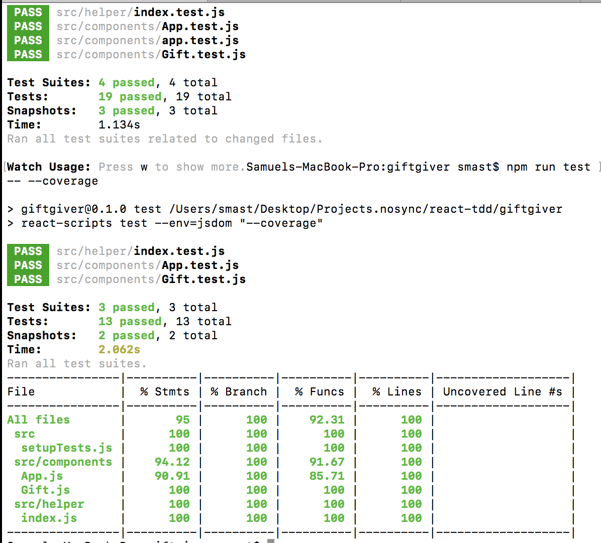

# Purpose 

* I created this app to learn/practice TDD (Test Driven Development)

- Tests written with Jest

- Created with Create React App

## App Functionality:

- Basic app to add gifts/person and see it rendered on list.  Can also remove items with button.

### Testing:

-Run testing with Jest

